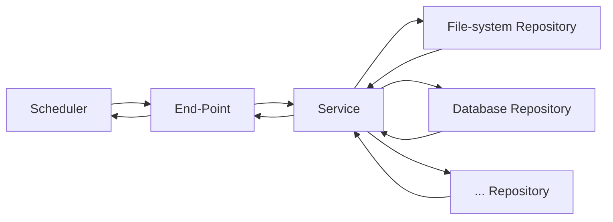

# Layers

The framework is structured using End-Point<-->Service<-->Repository layers.  It's a pattern outlining what code should live where.  Each layer has its
own set of responsibilities:

- End-Point: The entrance point for a requested action. It's responsible for making sure the parameters make sense, passing the request to the service layer, and formatting the response from service layer into something consumable by the requestor.
- Service: This is where the business-logic lives. It's responsible about making decisions about what should be done.
- Repository: This is where the code that actually goes out and does something lives. It's responsible for interacting with things outside of the service.

Correspondingly, the code that implements the things to be done will be found in the directories named:

- end_point: Contains the job setup, execution, and response to the caller.
- service: Contains the state-machines that make decisions about what to do.
- repository: Contains the interactions with file system, database, gpg...

The reason for separating things this way is testability.  By separating the code that decides what to do from the code that does something,
all of the decision branches in the business logic can be exercised by replacing the code that "does something" with "do nothing" or "fail miserably" mock code in
unit tests.

The framework is also implementing the Results Pattern.  Everything the code attempts to do can have one of two outcomes--it either succeeded or it failed.  Success and Failure are the "results" in the Results Pattern.

Any code where an exception can be raised resides in the Repository layer.  The Service layer will convert any exceptions into a Failure.

The reason for handling things this way is we can use unit tests to guarantee there are no there are no coding errors in out Service and End-Point layers.  It also provides us with a clean way to handle partial successes.  Say we want to backup a database server that has ten databases on it.  We don't want an exception raised while backing up the first database to block the potential success of the other nine databases.  We want the system to try to backup all ten and generate an alert for any that fail.

The Results Pattern accommodates this situation very well.  When the end-point reports back to scheduler, it ignores the successes and only reports failure occurrences.  The scheduler can then generate alerts based on the failure notifications it received.
